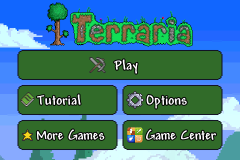
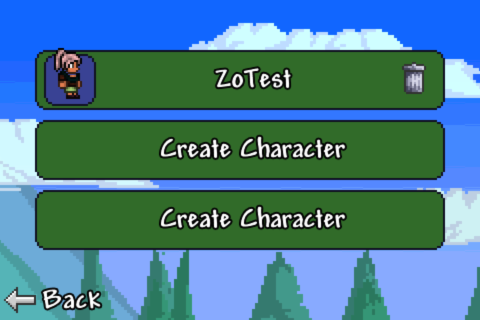
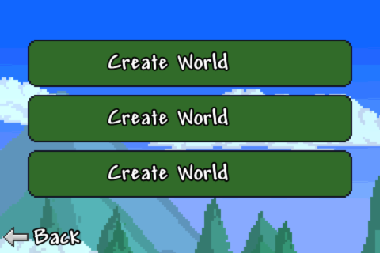
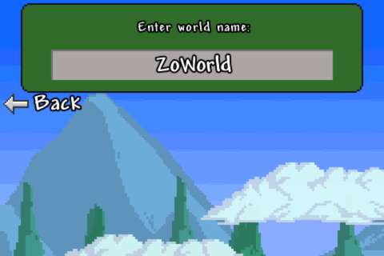
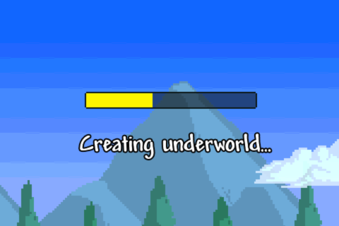
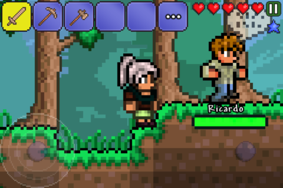
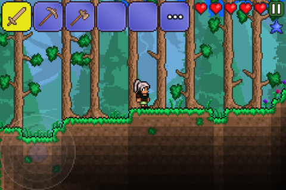

# Terraria 1.0: gameplay smoke test (2026-09-27)

## Result

Tested Archive.org's `Terraria 1.0.ipa` (`com.505games.terraria`, armv7) on Linux x86_64 using HyperHLE commit `5ab4d30a`, the `trunk` HEAD at test time. The app reached the main menu; I selected the existing `ZoTest` character, created `ZoWorld`, entered gameplay, and moved with the on-screen control. The gameplay log reached 60 FPS. No fatal signal or panic occurred. The sole startup warning was that the app has no launch image, so HyperHLE used `Default.png`.

The movement ended normally: `TOUCH-END #5` reported `moves=2` and `gesture_cancelled=false`.

## Automated tap smoke test

```sh
RUST_BACKTRACE=full xvfb-run -a python3 dev-scripts/ai-tap-sequence.py \
  /path/to/Terraria-1.0.ipa \
  --exe target/release/touchHLE \
  --cwd . \
  --step '45:0.5,0.4' \
  --final-wait 3 \
  --require-touch-delivery
```

Result: `PASS`; the script captured the main menu, tapped Play, and captured the character-creation screen. It recorded 42 EAGL FPS samples; the final five were `[30.83, 20.94, 20.23, 22.76, 22.72]`. UIKit logged 1 touch begin and 1 normal end.

## Full-playthrough captures

| Stage | Screenshot |
|---|---|
| Main menu |  |
| Character selection |  |
| World selection |  |
| World name |  |
| World generation |  |
| Gameplay |  |
| Movement |  |

## Test-suite status

- `python3 -m py_compile dev-scripts/ai-tap-sequence.py`: passed.
- Tap smoke test with `--require-touch-delivery`: passed.
- `cargo test -- --skip test_app`: 210 passed; 4 failed in unrelated tests already present on the tested `trunk` commit: two `gles_guest` varying-parsing tests, `sc_network_reachability::null_invalid_and_unsupported_contexts_are_distinguished`, and `trainer::invalid_memory_accesses_fail_without_a_panic_or_sink_write`. `test_app` was skipped because this environment lacks its custom LLVM/SDK toolchain. This change does not modify Rust code.

## Finding

The original Play tap was aimed too low: Play's center is approximately `(0.5, 0.40)` in normalized window coordinates, not `(0.5, 0.70)`. UIKit did receive and end the corrected tap, so no emulator-side touch fix was needed. The harness now supports an explicit working directory, reports early emulator exits, and can require successful UIKit touch delivery rather than passing on screenshots alone.
